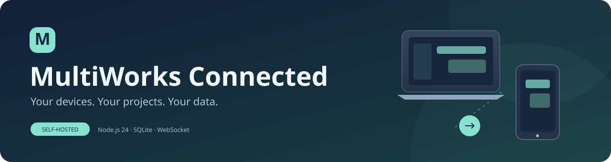
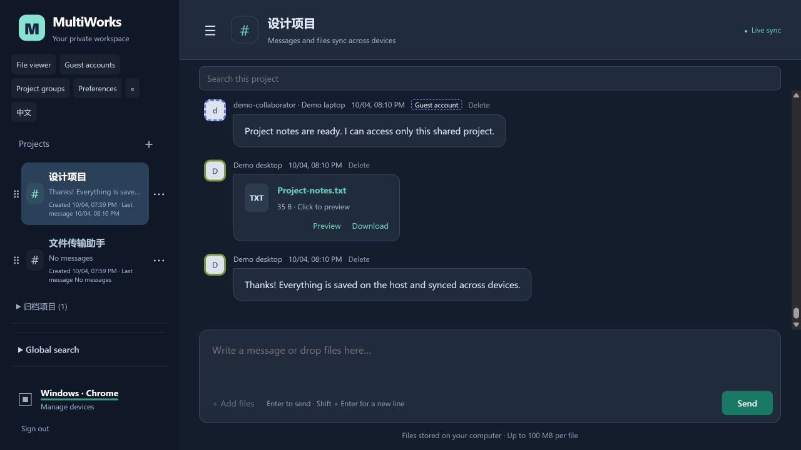
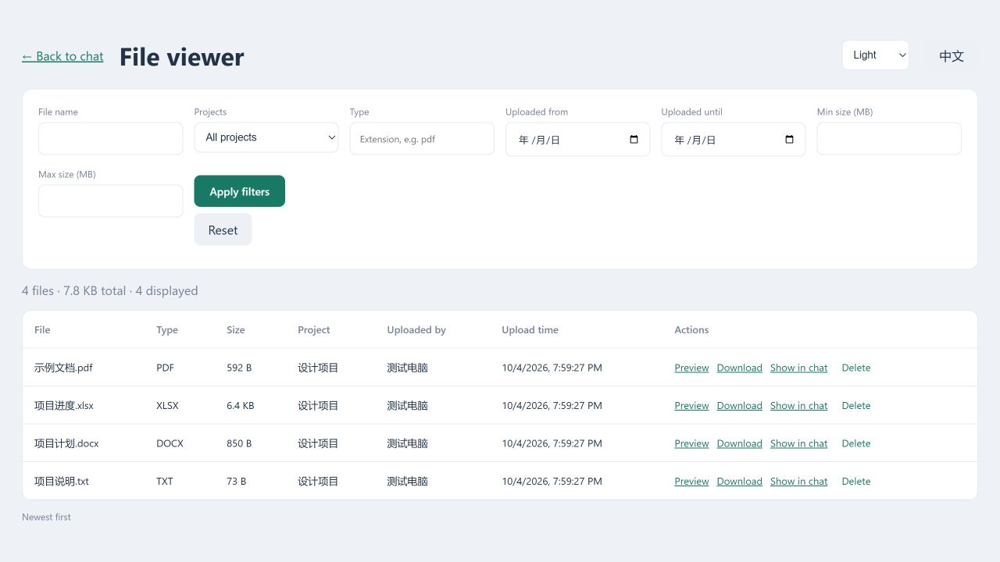
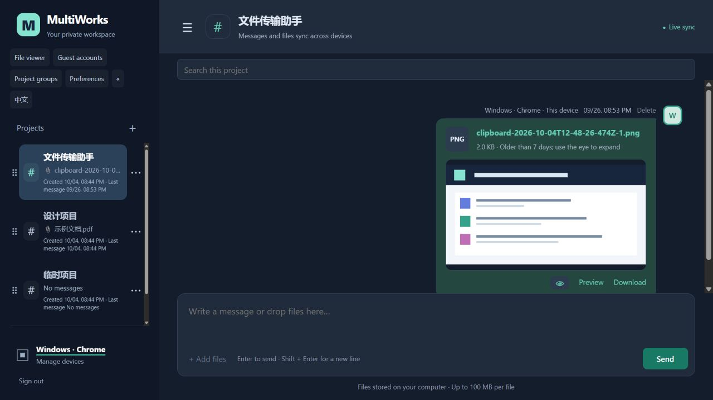
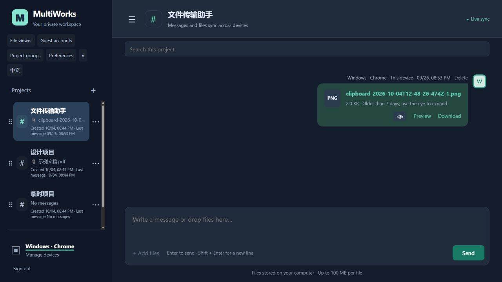
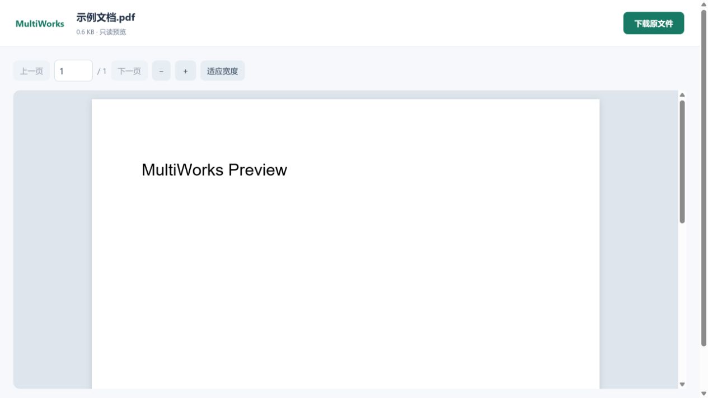

<p align="center"></p>
<h1 align="center">MultiWorks Connected</h1>
<p align="center">Continue work across devices. Invite collaborators with clear boundaries.<br>Chats, files and projects stay on your own computer.</p>
<p align="center"><a href="README.md">简体中文</a> · <strong>English</strong></p>
<p align="center"><a href="#quick-start">Quick start</a> · <a href="#usage">Usage</a> · <a href="#guest-accounts">Guest accounts</a> · <a href="#deployment">Deployment</a></p>
<p align="center"><code>Node.js 24</code> · <code>SQLite</code> · <code>WebSocket</code> · <code>Windows / Linux</code></p>

| Dark chat · Stay focused | File viewer · Keep things organized |
| :---: | :---: |
|  |  |

<p align="center"><sub>Real screenshots using synthetic data in an isolated test environment. Both the app and documentation support English and Chinese.</sub></p>

<details>
<summary>Clipboard screenshots and historical images</summary>

| Image expanded in chat | Older images collapsed by default |
| :---: | :---: |
|  |  |

</details>

## Overview

MultiWorks Connected is a personal workspace for sharing work across computers, phones, and tablets. Its chat interface organizes text, links, PDFs, and small archives into named project rooms.

The application and data live on your own computer. For remote access, a cloud server relays traffic without requiring a public IP address at home.

## Features

| Feature | Description |
| --- | --- |
| Project organization | Names, collapsible groups, drag sorting, creation and latest-message timestamps; actions in ⋯ menus |
| Live sync | WebSocket events, reconnection, catch-up for the active room |
| Text messages | Optimistic display, manual retry, deduplication, clickable links |
| Clipboard and images | Paste screenshots, confirm thumbnails, view images inline; expand older images on demand |
| Uploads | Drop anywhere, multiple selection, confirmation before upload, progress, cancellation, retry |
| File previews | Local PDF reader, images, text, Word text, and Excel worksheets |
| Downloads | Authentication, browser-managed progress, HTTP Range support |
| History | Per-room and global search with message navigation; batches of 100 messages |
| File viewer | Dedicated page with name, project, extension, date and size filters; uploader, timestamps and totals |
| Devices | Suggested OS/browser names, custom names, session listing and revocation |
| Guest accounts | Separate credentials, project grants, 1 / 3 / 5 / 7 / 30-day validity, disable and reactivate |
| Preferences | Light / dark / system theme, English / Chinese, collapsible sidebar, editable avatar border colors |
| Access protection | Server-side authorization, session and origin checks, failed-login limits |
| Local storage | SQLite for accounts and messages; local disk for attachments |
| Responsive UI | Desktop/mobile layouts, unread indicators, session-local drafts |

## Architecture

```text
Computer / phone / tablet browser
                │ HTTPS
                ▼
Cloud server: Caddy + frps
                │ frp TLS tunnel
                ▼
Home computer: frpc → Node.js application
                          ├── SQLite: accounts, sessions, messages
                          └── Local disk: attachments
```

Local use needs no cloud server. For public access, the cloud forwards requests while the home computer persists application data and stays powered on and connected.

## Quick start

Requires **Node.js 24 LTS**, npm, and a modern browser. Supports Windows and Linux; Ubuntu LTS is recommended for a dedicated host.

### 1. Get the project

```bash
git clone https://github.com/xiangzhong26/MultiWorksConnected.git
cd MultiWorksConnected
npm ci
```

### 2. Create configuration

Windows PowerShell:

```powershell
Copy-Item .env.example .env
```

Linux:

```bash
cp .env.example .env
```

### 3. Start

```bash
npm start
```

On the application host, open [http://127.0.0.1:3000](http://127.0.0.1:3000). Set a password of at least **12 characters** and a device name.

**There is no default password. Initialize locally before enabling public relay access.** The default setup listens on localhost only. Other devices cannot reach your host at that address; see the deployment guide.

## Usage

### Login and devices

1. After setup, log in on other browsers using the same password.
2. Names are suggested from the OS and browser, such as `Windows · Chrome`.
3. Select the bottom-left device name to rename it or revoke a device's sessions.
4. On mobile, open the top-left menu to manage devices or switch rooms.

Identity is per browser, not a hardware serial number. Private browsing or clearing storage creates a new identity; sessions expire after 30 days.

### Project rooms

- Select **＋** next to the room heading to create a named room.
- Select a room in the sidebar to switch projects.
- Select **⋯** beside a project to rename, move to a group or delete it. Deletion needs a separate confirmation.
- Drag a project's **⠿** handle before another project to reorder it. Cross-group dragging moves the project into the destination group; ordering syncs across devices. Focus the handle and use arrow keys as a keyboard alternative.
- Use Project groups to create or rename groups. Groups start collapsed; removing a group retains its projects and messages.
- Each project shows creation and last-message times. **«** collapses the sidebar; **☰** expands it.
- Administrators see all projects; guests see only their granted projects.

### Messages and files

- Type a message and select Send. **Enter** sends; **Shift + Enter** inserts a newline on desktop.
- Select Add file or drop files anywhere on the page, including the composer; multiple selection is supported.
- Use **Ctrl + V** (**⌘ + V** on Mac) in the composer to paste text, links, clipboard files or screenshots, including WeChat screenshots. Images show local confirmation thumbnails before any upload. Ordinary text keeps its native paste behavior.
- PNG / JPEG / GIF / WebP images display inline and open full previews when clicked. At 7×24 hours old, images default to file information only; use **👁** to expand or collapse them in chat. This display rule never deletes images or messages.
- Check the destination room, names, and sizes in the confirmation dialog, remove unwanted files, then select Confirm send. No upload starts before confirmation.
- Watch upload progress, cancel if needed, or select Retry after failure.
- Open the same room on another device to receive messages and files in real time.
- Select a file card to preview it, or select Download below it; progress appears in the browser's download manager.
- Supported desktop browsers can drag a file card into a local folder. This depends on the browser and OS; use Download if dragging fails or produces a link instead.

The default limit is **100 MB per file**. Upload retries retransmit the whole file; chunked and resumable uploads are not implemented.

Folder uploads are unsupported. A folder drop asks you to compress it first. Failed uploads keep separate Retry and Cancel buttons; unreadable content must be canceled and selected again.

### Search and deletion

- Search text and filenames in the active room; clear the field to return to normal history.
- Select Load earlier messages to retrieve older records.
- Select Delete beside a message and confirm to remove it and its attachment. **Deletion affects every device and cannot be undone.**

### File viewer and global search

- Open **File viewer** from the sidebar. Filter by filename, project, extension, upload dates and size.
- Rows show type, size, project, uploader and upload time. Totals show matching file count and size.
- Preview, download, or select Show in chat to return to and highlight the original message.
- Deleting a file also deletes its chat message and the physical attachment on the host.
- Expand Global search, enter a keyword, and select a result to open and highlight its original message.
- Navigation works for messages older than the most recent 100 records.
- From a historical location, load subsequent messages or return to the latest messages. Room deletion also clears matching library and search entries.

### Appearance and language

- Preferences offers light, dark and system themes across chat, file viewing and previews.
- Each browser identity gets a colored avatar border. Change it in Preferences; new messages use the new color while older messages retain their original color.
- Guests have dashed borders and a Guest account badge. Administrators can set the guest's default color when creating or editing it.
- Use **English / 中文** to switch the app language. Theme, language, sidebar visibility and collapsed groups are saved in the current browser.

### Guest accounts

Select **Guest accounts → Create guest account** as an administrator. Set a username, a password of at least 12 characters, granted projects and validity. Share the site address and credentials with the collaborator. Every browser using the administrator password can manage these accounts.

| Action | Result |
| --- | --- |
| Expire / disable | Access and sessions expire; account and messages remain; zero project grants also block login |
| Revoke project grants | Existing sessions are invalidated immediately; new login sees only remaining grants |
| Edit / reactivate | Starts a new 1, 3, 5, 7 or 30-day period from saving; grants and password can change |
| Permanently delete account | Deletes credentials, grants and sessions; retains messages, attachments, author names and guest badges |

Guests can chat, upload, preview, download and delete messages sent from their current browser within granted projects. They cannot create, edit, reorder or delete projects, manage accounts or manage other devices. Passwords are hashed and cannot be viewed after saving.

### Long histories and loading

Opening a project jumps directly to its latest messages. Requests fetch at most 100 messages; the browser retains a window of at most 300 loaded records. Paging replaces this browser window without deleting database history. Older messages remain available through paging and search. Reconnection fetches a recent window instead of replaying the entire history.

### Preview formats and limits

| Format | Preview |
| --- | --- |
| PDF | Local reader with page navigation, zoom, and current-page text extraction; no PDF scripts |
| PNG / JPEG / GIF / WebP | Image preview |
| TXT / Markdown / CSV / JSON and common code files | Plain text, first 1 MB; HTML is shown as source only |
| DOCX | Word text extraction, without full layout fidelity; up to 200,000 characters |
| XLSX | Up to 10 worksheets, 200 rows and 30 columns per sheet; no formula or macro execution |
| Other formats | Original download, including legacy DOC / XLS, archives, and unprocessable documents |

Previews run locally without sending content to third parties. Office previews are limited to 10 MB with conversion time and memory limits. Encrypted or damaged documents require local download. Previews are read-only; online editing is not supported.



## Configuration

Set values in the local `.env` file and restart after changes.

| Variable | Default | Purpose |
| --- | --- | --- |
| `HOST` | `127.0.0.1` | Listening address; localhost only by default |
| `PORT` | `3000` | Application port |
| `DATA_DIR` | `./data` | Storage directory, relative to the process working directory |
| `PUBLIC_ORIGIN` | Empty | Public origin, e.g. `https://work.example.com`, without a trailing slash |
| `COOKIE_SECURE` | `false` | Set to `true` for production HTTPS |
| `MAX_FILE_MB` | `100` | Per-file upload limit in MB |

Use the project root as the working directory. For production, use an absolute data path such as `/var/lib/multiworks`.

## Deployment

Run on an Ubuntu LTS laptop and use a cloud server for HTTPS and frp relay traffic. Systemd units for the application, frpc, and frps, plus a Caddy example, are included.

- **[English deployment guide](docs/DEPLOY.en.md)**: Ubuntu, initialization, relay, HTTPS, backups, and Windows notes.
- **[中文部署指南](docs/DEPLOY.zh-CN.md)**.
- Templates are in [`deploy/`](deploy/); replace domain, IP, and secret placeholders.

Validate two-device sync, file transfers, network recovery, and startup after reboot on your actual network. Throughput depends on host upload bandwidth, cloud bandwidth, and client connectivity.

## Security and privacy

**Messages and attachments have no automatic retention expiry or record-count cap.** Batches of 100 are pagination, not deletion; the 30-day expiry applies only to login sessions. Data stays in `DATA_DIR` until you explicitly delete messages or rooms, or external deletion, disk failure, or insufficient storage interferes. Preserve and reuse the same data directory when updating, restarting, or moving the deployment, and make regular backups.

- Passwords are salted scrypt hashes. Cookies use `HttpOnly` and `SameSite=Strict`; enable `Secure` for production HTTPS.
- Messages, search, attachments, previews and WebSocket events enforce project grants. Administrators keep full management access.
- Public access uses HTTPS. The frp examples force TLS; configure certificate verification to authenticate the relay.
- HTTPS terminates on the cloud server, whose administrator can technically read forwarded content. **There is no end-to-end encryption or database/attachment encryption at rest.**
- Never commit real `.env` files, frp configuration, private keys, databases, attachments, logs, or backups.
- Test passwords are disposable fixtures; example tokens are placeholders, not default credentials.

Default storage:

```text
data/
├── workspaces.sqlite      # Account, devices, sessions, rooms, messages
├── workspaces.sqlite-wal  # May exist while running
├── workspaces.sqlite-shm  # May exist while running
└── files/                 # Attachments with randomized storage names
```

`.gitignore` excludes default data and common secrets, but cannot prevent forced commits or protect every custom attachment directory. Keep custom data outside the repository or add ignore rules. For backups, stop the service, copy the entire data directory, then restart; backups contain sensitive data and valid sessions.

## Development and validation

```bash
npm test
```

Integration tests use isolated temporary directories and include legacy migration, guest expiry and revocation, reactivation, retained history after account deletion, scoped realtime events, file filters and physical attachment deletion, as well as login protection, origins, live events, room isolation, deduplication, Unicode filenames, upload limits, file authorization, Range downloads, session revocation, search, deletion, and restart persistence.

Additional tests cover composer drops, upload confirmation/cancellation, drag-out download data, previews, historical navigation, global search, and room deletion cleanup.

For an existing deployment, fetch the new code, run `npm ci`, and restart the application (`sudo systemctl restart multiworks` on Ubuntu). Keep your existing `.env` and data directory; no account or database reset is needed.

Passing tests do not constitute public deployment or performance acceptance; validate on real devices and networks.

## FAQ

**Why can't another device open `127.0.0.1:3000`?**

It refers to the requesting device itself. The default setup is local to the application host; cross-device access needs the relay entry point.

**Why is the page unavailable or reconnecting?**

Check that the host is awake and online, then check the application, frpc, cloud frps, and Caddy.

**Why is an origin mismatch reported?**

Match `PUBLIC_ORIGIN` to the actual origin, including scheme and port, with no trailing slash. Restart after changing it.

**Why did an upload fail?**

Check `MAX_FILE_MB`, disk space, and connectivity. Retry after network recovery; the entire file is uploaded again.

**Does it support teams and separate accounts?**

Temporary collaborator accounts support project grants. Administrator devices share full access; guests are restricted. Audit logs, enterprise organizations and self-service registration are not implemented.

## Project status

For personal work and small temporary collaborations. Self-host on Windows / Linux with English, Chinese and dark mode. No license has been specified.
